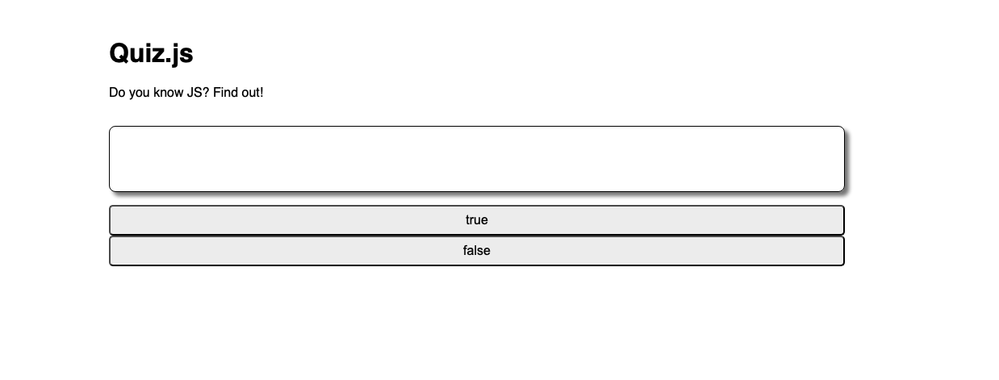

## Quiz JS App

we're going back to basics and by that, I mean we're really diving deep on the JS fundamentals.Is this work a bit redundant and a step back? Sure. But, what better time than now to firm up my knowledge of JS before going deeper with React and TypesScript.

So.... this is just a small step back into vanilla JS land to build a very simple quiz shown below

